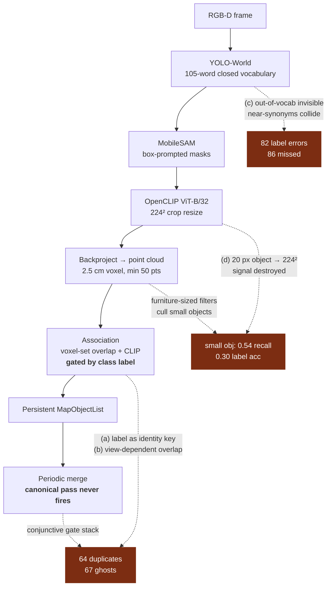

# Robonix Scene: accuracy and resource analysis

**Scope.** Why Scene's object world model scores 0.670 micro-F1, how the pipeline diverges from the ConceptGraphs paper it is built on, and why it does not fit on Orin-class hardware.

**Evidence.** The five-world Webots evaluation behind [syswonder/robonix#199](https://github.com/syswonder/robonix/pull/199) — per-object statuses, `perception_quality` and `merge_gate_diagnostics` read out of the `DATA[]` payload in the generated review page, not restated from the summary table — plus the ingest path (`system/scene/scene_service/ingest/perception_concept_graphs.py`) on branch `agent/scene-object-management-177`, and the three Jetson build/run targets.

---

## Executive summary

The 0.670 micro-F1 is not one problem. It is three roughly equal ones — identity fragmentation, spurious geometry, and naming — and they have different root causes, so they need different fixes.

| | Count | Root cause |
|---|---|---|
| Correct object, correct label | 138 | — |
| Correct object, **wrong label** | 82 | Closed 105-word vocabulary; 56% are near-synonym collisions |
| **Duplicate** (prediction on top of a real object) | 64 | Class-gated association; canonical merge never fires |
| **Ghost** (no admissible truth nearby) | 67 | Same, plus fragments drifting off the parent object |
| **Missed** truth | 86 | Small-object culling; exploration coverage |

Three findings drive everything below:

1. **`canonical_eligible_pairs: 0` in all five worlds.** The upstream ConceptGraphs merge pass never fired once. The gate stack around it has become so conjunctive that it is unreachable.
2. **Sub-30 cm objects score 0.54 recall and 0.30 label accuracy**, against 0.77 / 0.69 for everything larger. The pipeline collapses on small objects on both axes simultaneously.
3. **PR #199 contains no resource work at all**, and its hottest new path runs an O(N²) Python loop every tick. The Jetson complaints are untouched.

---

## 0. What PR #199 already tried

14.5k lines across 37 files in `system/scene` alone. A lot of it lands, and the part that lands best is the part worth keeping.

### What works

**The measurement apparatus is the most valuable thing in the PR** — and it is what makes this analysis possible at all. `merge_gate_diagnostics`, the per-pair candidate dump with 2D-IoU evidence, `transform_source_counts`, the five-world ground-truth export, the visibility-scoped metrics. Without those, none of the failures below could be localised. That investment should stay and should grow.

**The observation lifecycle lands.** `_visible_missing_uuids` projects a bounded sample (≤25 points per object) of the stored cloud into the current depth frame and counts a miss only when the measured surface is materially *behind* the stored geometry. Occlusion, depth holes and out-of-FOV are all correctly treated as "unknown" rather than "gone". That is exactly the absent-vs-dropout distinction issue #177 asked for, and it is cheap.

**So do the recovery path and geometry admission.** `object_mutations.py` with epoch/concurrency tokens and atomic apply-with-rollback; depth-MAD mask refinement; the robust min-area-rectangle bbox replacing PCA yaw; occupancy-bounds admission. Objects no longer land outside the mapped rooms — #177's headline complaint is fixed.

### Where the effort went the wrong way

**The association work is entirely additive.** Count the conditions a pair must now satisfy to merge:

> association-group compatibility · adaptive distance · global distance · one-to-one · exact-duplicate geometry · tolerant voxel coverage · co-observed 2D-IoU (≥3 shared frames **and** median IoU ≥0.85 **and** visual ≥0.9) · disjoint-history (≥2 unique frames **and** ≤1 frame gap **and** centre/extent ratio ≤0.20 **and** visual ≥0.85) · same-class extent ratio

Every one is conjunctive. Every one was individually justified by a real failure. Together they closed the door: `canonical_eligible_pairs: 0` in all five worlds, and a 0.19–0.29 duplicate rate in three of them.

**The one remedy the code itself calls essential is off by default.** `_cross_class_geometric_collapse` — whose config comment calls it "the only thing strong enough to undo a 3-way YOLO label split on a wall fixture" — is guarded by `if self._allow_cross_class_merge`, which defaults false and which the README documents as a *"legacy emergency escape hatch… not recommended for normal deployments"*. Meanwhile `cross_class_geometry_rejected_pairs` runs 61–183 per world.

**The label work makes the answer stable, not correct.** Histogram evidence, support and share gates, switch margins, a per-label margin table, geometry bonuses. All of it reduces flicker in an argmax over a vocabulary that cannot express the distinction being asked of it. A stable wrong label is what the metric now measures.

**There is no resource work in this PR** — no fp16, no model tiering, no dependency reduction, no profile switch. The only build-file changes are grpc/protobuf pins. Net per-tick cost went *up*: `same_class_merge_interval_ticks` is `1`, so `_same_class_proximity_collapse` runs an O(N²) Python loop **every tick**, and each candidate pair calls `_exact_duplicate_geometry_matrix`, which rebuilds voxel sets from up to 5000 points per object with no caching between pairs or between ticks.

> **Minor, but worth fixing while nearby.** Two comments now assert a Jetson-invalid premise: `_merge_overlap_no_p3d` says *"No callsite hits this today since pytorch3d ships in the docker image"*, and the cleanup path says `merge_overlap_objects` *"uses pytorch3d under the hood"*. But `scene-pytorch3d.txt` gates pytorch3d to `platform_machine == "x86_64"` and `requirements.txt` says it was removed outright. Harmless at runtime — we always supply our own matrix — but it will send the next person debugging a Jetson down a wrong path.

**Net read: this PR built the instrumentation that proves the architecture is the problem. The next step should be subtractive.**

---

## 1. The error budget, measured

Stratifying by ground-truth object size sharpens the picture considerably:

| GT max dimension | n | recall | label accuracy among matched |
|---|---:|---:|---:|
| < 0.30 m | 69 | **0.54** | **0.30** |
| ≥ 0.30 m | 237 | 0.77 | 0.69 |

Missed truths are dominated by exactly those small objects: wineglass ×7, book ×5, plate ×4, carafe ×3, orange ×3, and bowl / knife / spoon / apple ×2 each. Systematic, not scene-specific noise.

The label errors are overwhelmingly *near-synonym* errors inside our own vocabulary. Pairing each mislabelled prediction to its nearest mislabelled truth, **46 of 82 (56%) are confusions within one coarse category**:

| Confusion | n |
|---|---:|
| shelf ↔ cabinet ↔ counter | 9 |
| cup ↔ jar / can | 8 |
| picture_frame ↔ window | 4 |
| couch ↔ chair | 3 |
| television ↔ monitor | 2 |
| pot ↔ pan | 2 |

The remaining 36 are genuine cross-category errors, concentrated on the small objects above.

**Precision and recall are also confounded with exploration.** `coverage` is 0.47 (office), 0.60 (kitchen), 0.77 (complete_apartment). Office's "recall 0.917" and complete_apartment's "0.679" are not comparable to each other while half of one room was never visited.

---

## 2. Divergence from ConceptGraphs

The module docstring says we keep ConceptGraphs as the perception backbone. In practice five things changed, and four of them are causing the numbers above.



### (a) Association and merging are class-gated. In the paper they are class-agnostic.

This is the big one. `_association_compatible()` requires both labels to fall in the same merge group, and `allow_cross_class_merge` defaults false — reported as `"allow_cross_class_merge": false` in every run.

ConceptGraphs deliberately never lets the detector's class name participate in association: an object's identity is its point cloud plus its CLIP descriptor, and the name is a *property* derived afterwards. We made the name a *key*, which reintroduces exactly the over-segmentation the paper's design exists to avoid.

A representative rejected pair from the office run:

```
left: "bathtub"          right: "couch"
center_distance_m: 0.335   voxel_overlap: 0.714   clip_cosine: 0.711
class_compatible: false   →  REJECTED
```

One physical sofa, split into two tracks with two labels, with 71% volume overlap and 0.71 CLIP cosine — and we refuse to merge it *because the labels differ*, when the differing labels are themselves the bug. This is where most of the 64 duplicates come from, and a good share of the 67 ghosts (a fragment that drifts off the real object stops being "duplicate" and becomes "ghost").

### (b) The spatial similarity is not the paper's, and the substitute is view-dependent.

The paper's `overlap` is a nearest-neighbour ratio: the fraction of detection points whose nearest neighbour in the object cloud falls within a radius. We substituted exact voxel-set intersection on a 2.5 cm grid (`_voxel_pcd_overlap_matrix`) because the upstream path went through `pytorch3d.box3d_overlap` and crashed on coplanar vertices.

Right call for stability — but exact voxel intersection is *strictly harsher* in precisely the case that matters. The same surface observed from a different viewpoint is sampled at different points, and with RGB-D noise ≥ 2.5 cm the two observations land in adjacent voxels and score ~0. So spatial similarity collapses toward zero exactly when it needs to carry the cross-view merge.

The config comments record the resulting struggle: `merge_threshold` was hand-walked between 0.55, 0.85 and 1.10, after which the distance gate, adaptive distance gate, one-to-one gate, co-observed 2D-IoU gate and disjoint-history gate were stacked on top. A radius-tolerant nn-ratio (cKDTree, radius ≈ 1–2 voxels) restores the paper's behaviour and lets most of that stack go.

### (c) Naming is a closed 105-word argmax plus a hand-tuned rerank.

The paper names objects with an LLM over multi-view crops. Ours is: YOLO-World argmax over a fixed 105-class prompt list → temporal histogram → `_clip_rerank_label`, which reranks only *within a manually configured candidate set* per label (`window ↔ picture frame`, `chair ↔ monitor`, …) with per-label margins in config. The office run carries a margin table with entries like `window: 0.002`, `monitor: 0.0`, `shelf: 0.06` — fitted to these Webots worlds, and they will not transfer.

Two structural consequences:

- The vocabulary contains ~8 near-synonymous storage words (shelf / bookshelf / cabinet / drawer / dresser / wardrobe / counter / nightstand) and ~8 near-synonymous vessel words (cup / mug / glass / wineglass / paper cup / jar / can / thermos). ViT-B/32 text prototypes for those are nearly collinear, so the choice among them is close to a coin flip. That is the 56% within-group error rate, and no amount of per-pair margin tuning fixes it — the pairs are combinatorial.
- Anything outside the 105 words is unnameable and, because YOLO-World is also our *proposal* mechanism, largely undetectable. In the paper, proposals come from class-agnostic SAM, so recall is bounded by segmentation, not by a word list.

**We already run a VLM on numbered-box renders of the tracked objects** — `scene_graph/builder.py` + `image_relations.py`, every ~30 s, for relation extraction. It receives exactly the input the paper's captioning stage needs, and we throw the naming opportunity away.

### (d) CLIP descriptors are computed on 224² resizes of small crops.

At 640×480, a wineglass at 2 m is ~20 px wide. Upsampled to 224² it carries essentially no signal, so the descriptor (association) and the rerank (naming) degrade *together* — which is the mechanism behind the 0.54 recall / 0.30 label accuracy on sub-30 cm objects.

Compounding it: `downsample_voxel_size` 2.5 cm with `min_points_threshold` 50 and `obj_min_points` 20 means an 8 cm object must survive a filter sized for furniture.

### (e) Pose provenance differs from the paper's setting — but this one is mostly not our bug.

ConceptGraphs is evaluated on Replica/ScanNet with ground-truth poses; we run on live SLAM. The artifact shows 92% of frames resolved through `stamped_odom_plus_current_map_correction` rather than a full stamped TF lookup:

```
transform_source_counts: { stamped_full_tf: 26,
                           stamped_odom_plus_current_map_correction: 298 }
```

**This is correct behaviour, not a fallback failure.** `_build_camera_to_map_transform` deliberately splits the chain as `T(map←camera,t) = T(map←odom, latest) @ T(odom←camera, t)`, because RTAB-Map publishes its global correction behind the newest sensor stamp and an exact full-chain lookup would sit in future-extrapolation forever. Robot motion is evaluated at the image stamp; only the slowly-varying global correction is taken at latest. That is the right REP-105 handling.

The residual error is bounded by how much the correction *jumps* between observation and ingest — not by the 2.409 m `map_correction_total_translation_m`, which is a sum of magnitudes over the whole run and is not an error term. The real exposure is `map_correction_max_translation_m`: 0.082 m (office), 0.105 m (break_room), 0.113 m (kitchen), and **0.0** in apartment and complete_apartment, where v101/v102 disabled rebasing entirely.

That last fact cuts against keeping the rebase machinery:

| World | rebasing | rebases | median centre error |
|---|---|---:|---:|
| apartment | **off** | 0 | **0.145 m** (best of five) |
| complete_apartment | **off** | 0 | 0.303 m — and F1 went 0.349 → 0.611 |
| office | on | 146 | 0.281 m |

The evidence says map-correction rebasing was actively harmful and should be deleted rather than fixed.

What *is* left on the substrate side is the map itself: `wall_angle_p95_error_deg` is 9.7° in kitchen and **25.5°** in complete_apartment. In the large world the SLAM map is skewed and object geometry inherits it, capping how good the centre-error number can get regardless of perception.

---

## 3. Why Scene doesn't fit on a Jetson

This is the complaint heard most often, and it has the best effort-to-value ratio. Nothing here is a research problem.

**Two full CLIP ViT-B/32 models are resident at once.** `_try_load_models()` constructs `YOLO(yolov8l-world.pt)` — ultralytics instantiates a `clip-anytorch` ViT-B/32 text tower to service `set_classes()` — and then separately builds `open_clip` ViT-B/32 from `/opt/models/open_clip_pytorch_model.bin` (≈605 MB fp32). We pay for the same architecture twice, and after `set_classes()` the first is dead weight: the prompt embeddings are baked and the text tower is never used again.

**Everything is fp32.** No `.half()`, no autocast anywhere in the ingest path — the only `torch.no_grad()` uses are in the rerank/embed helpers. Orin's fp16 tensor cores sit idle. That is 2× weight memory and roughly 2× latency, for free.

**No TensorRT / ONNX path.** Once `set_classes()` has run, YOLO-World is a fixed-vocabulary YOLOv8-l and `model.export(format="engine", half=True)` applies directly. On AGX Orin the gap between PyTorch fp32 and TRT fp16 for YOLOv8-l at 640 is roughly an order of magnitude.

**`yolov8l-world` is the default on every target,** including `jetson-native`. The `-l` variant is ~4× the FLOPs of `-s`. There is no profile switch.

**The import surface is enormous and most of it is dead.** Importing concept-graphs' `slam.*` transitively requires `hydra-core`, `omegaconf`, `openai`, `wandb`, `rich`, `matplotlib`, `seaborn`, `faiss-cpu` and `supervision` — the requirements file has comments explaining that several exist purely to satisfy unconditional upstream imports we never call. We use about eight functions from that package, and we already replaced its `pytorch3d` path. `open3d` — used only for voxel downsample, DBSCAN and AABB, all of which are short numpy/`cKDTree` — is several hundred MB of RSS and the most fragile aarch64 dependency in the stack.

**There is no perception-free profile.** Issue #156 already asked for this: a deployment that only wants robot pose, room annotations and map binding still drags in torch, a CUDA context, YOLO-World and MobileSAM. On an Orin Nano sharing 8 GB with rtabmap, Nav2 and the DDS stack, that is the difference between "boots" and "doesn't".

**Per-tick CPU grows quadratically with map size, in pure Python, under the inference lock.** `_voxel_pcd_overlap_matrix` builds a `frozenset` of 3-tuples per object cloud, and `_voxel_pcd_overlap_torch(det_list, self._map_objects)` calls it against **all** map objects **every tick** — no frustum filter, no spatial pre-gate, no caching between ticks. In complete_apartment that is 165 objects × up to 5000 points, on the order of 8×10⁵ Python tuple allocations per tick at 1.6 Hz, plus the O(N²) cleanup pass and the every-tick same-class collapse added by #199. On x86 this is merely wasteful; on Orin's cores it is the tick budget.

---

## 4. Proposed direction

### Accuracy

**A1 — Make identity class-agnostic again.** Default `allow_cross_class_merge` to true; remove the class gate from association and from `merge_overlap_objects` eligibility. Keep the *geometric* identity test already built (voxel coverage + extent ratio + centroid distance) as the safety net — it is the right kind of gate, because it constrains physics rather than vocabulary. Treat the label as a per-track histogram property. Should recover most of the 64 duplicates: micro precision 0.627 → ~0.75 on duplicates alone, F1 → ~0.74, before any naming work.

**A2 — Replace exact voxel intersection with a radius-tolerant nn-ratio.** `cKDTree(object_points).query_ball_point(det_points, r=2×voxel)` → fraction matched. This is the paper's measure, it is view-invariant, and it lets us delete several compensating gates. Do A1 and A2 together, then re-tune `merge_threshold` once from evidence rather than per-world.

**A3 — Move naming to the VLM already running.** `image_relations.py` already renders numbered boxes every ~30 s. Extend that one call to return `{box_id: name}` alongside the relations, and demote YOLO-World to a pure *proposal* mechanism whose class output feeds the histogram as a weak prior. Deletes the closed vocabulary from the naming path, deletes the per-label margin table, and directly attacks the 46 near-synonym errors — a VLM looking at a kitchen does not confuse a counter with a cabinet. Keep the current path as the offline/no-credentials fallback.

**A4 — Scale-aware geometry admission.** Make `downsample_voxel_size`, `min_points_threshold` and `obj_min_points` functions of the detection's apparent extent rather than constants sized for furniture — e.g. voxel = `clamp(0.3 × min_extent, 0.01, 0.05)`. Combined with a higher-resolution second detection pass (larger `imgsz`, or SAHI-style tiling on the central crop) gated to when the base is stationary, this targets the 0.54 small-object recall.

**A5 — Retire map-correction rebasing rather than fixing it.** The transform split is right and should stay. But the rebase path carries its weight in the wrong direction (see §2e). Delete `rebase_map_corrections`; instead record the map→odom correction *in effect at the observation stamp* alongside each cloud contribution, so a later jump is a known quantity rather than something we retroactively smear the accumulated cloud with.

**A6 — Report `recall@covered` and per-size-bucket metrics,** and make the gates relative to those. Today a coverage regression and a perception regression are indistinguishable in the summary table, and small-object regressions are invisible because they are averaged against furniture.

### Resources

| | Change | Effect |
|---|---|---|
| **R1** | Bake YOLO-World prompt embeddings at build time (`set_classes()` then `model.save()`) | Drops `clip-anytorch` and one entire ViT-B/32 (~600 MB fp32 host + device copy). Vocabulary changes become a build step — the right semantics for a deployed robot |
| **R2** | fp16 across YOLO, MobileSAM and CLIP, with an env escape hatch | ~2× on both memory and latency |
| **R3** | TensorRT engines for YOLO-World and the MobileSAM encoder, built on first boot into `/opt/models`, cached by device + TRT version | Where the Orin tick budget actually comes from |
| **R4** | A `perception.profile` knob (`full` / `jetson` / `lite`) selecting model size, `imgsz`, tick period, detection caps | Today every target gets the x86-5090 configuration |
| **R5** | Vendor the ~8 concept-graphs functions we call into `ingest/cg_kernels.py`; drop `/opt/concept-graphs` plus hydra, omegaconf, openai, wandb, rich, matplotlib, seaborn, faiss, supervision | We already forked the hard part; the remaining coupling is thin |
| **R6** | Drop Open3D — voxel downsample is `np.unique` on packed int64 keys, DBSCAN is `cKDTree` + union-find, AABB is min/max | Biggest single RSS win; removes the most fragile aarch64 dependency |
| **R7** | Vectorise and cache the overlap kernel: packed int64 voxel keys, `np.unique` per cloud, cached on the object with a version counter, sorted-array set ops | 2–3 orders of magnitude; stops allocating ~10⁶ Python tuples per tick |
| **R8** | Frustum- and distance-gate the per-tick similarity — visibility is already computed for the dropout watchdog | 165 → typically <20 candidates in complete_apartment |
| **R9** | Move periodic cleanup off the inference lock: compute the merge plan on a snapshot in a background thread, apply transactionally | A cleanup tick currently stalls ingestion |
| **R10** | fp16 safetensors in `/opt/models`; store per-object clouds as contiguous float32 XYZ + uint8 RGB instead of Open3D `PointCloud` objects | ~3× smaller, and it is the representation R7 wants anyway |
| **R11** | Land the `lite` profile from #156 — pose, rooms, annotations, map binding, **zero** torch import | Turns "Scene won't run on my Orin Nano" into "Scene runs, without object perception" |

---

## 5. Suggested sequencing

**R7 + R8 first.** Pure wins, no behaviour change, and they make every subsequent benchmark sweep cheaper. R7 should also fold in `same_class_merge_interval_ticks: 1`, the single hottest path #199 added.

**Then A1 + A2 together,** with one re-tune of `merge_threshold`. Largest single accuracy step, and it lets us **delete** most of the §0 gate stack rather than add to it. Concretely, A1 + A2 should let us drop the association-group gate, the co-observed 2D-IoU gate and the disjoint-history gate outright, keeping only the distance gate, the one-to-one constraint and the geometric identity test. Those three exist to compensate for a similarity measure that, once fixed, no longer misbehaves — better to delete them than keep tuning them. The diagnostics #199 added are exactly what will tell us whether that is safe.

**Then R1–R4 as the Jetson enablement batch,** with R11 in parallel since it is independent.

**A3 after that,** since it changes what the label metric measures and should not be confounded with A1/A2.

**A5 and A6 any time** — both make everything above easier to evaluate.

> **One process note.** The CI GPU capacity failure means these five worlds are WorkPC captures rather than CI-reproduced runs. Before tuning thresholds against them again, the sweep should be reproducible in CI — the per-label margin table in the current config is a sign that we have been fitting to unreproducible runs.
